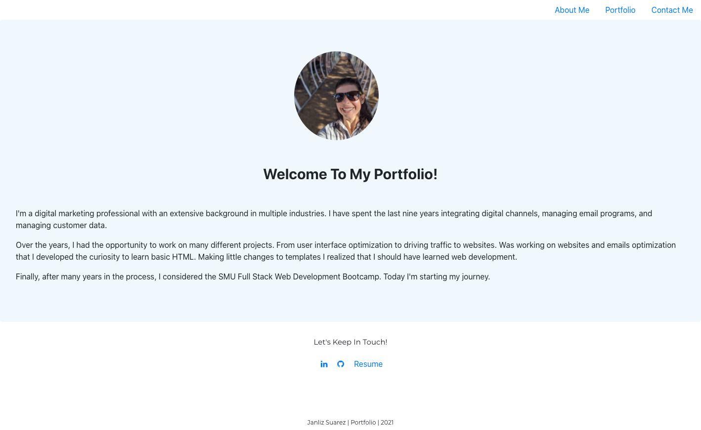

# Porfolio:

The assignment consisted of creating a website as a portfolio.

# Requirements:

Create a website containing the following pages and information:

* About Me - contain some information about myself
* Porftfolio - contain projects information
* Contact - page with a form

**Criterias:**

* Create footer, navbar and portfolio component

# Page Mockups:

Screenshot

# Additional Information:

* The portfolio page contains wireframes/placeholders for the information. As I continue creating projetcs, I'll be adding them to this page.

* The contact page contains the form, but is not working yet. We'll learn in the class how to make it work.

# Resources:

* React - used to modify html and css files
* Google developer tools - to test changes
* Chrome, Safari, Firefox - to ensure page render correctly
* Boostrap Framework and React-Bootstrap
* Awesomefonts

# Repository:

* Repository: https://github.com/CivicaJR91/react-portfolio
* Page Link: 